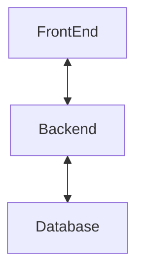

## Objetivo:
#### Definir a arquitetura geral do projeto

**Pontos a considerar:**
- Escalabilidade
- Estabilidade
- Expansão rapida das funcionalidades
- Expansão rapida do time

## Resultado:
#### Arquitetura com forte desacoplamento, com o seguinte norteamento:
- Organização e agrupamento conforme DDD
- Arquitetura orientada a serviços.
- Forte desacoplamento entre logica de negocio e base de dados
- Frontend Desacoplado do backend, com minimo ou zero regra de negocios

*Visualização simplificada da arquitetura*

##### Prós:
- Segregação de responsabilidades, permitindo multiplos times trabalharem juntos
- Escalonamento apenas dos servicos criticos
- Balanceamento de carga mais eficiente
- Testabilidade mais presente e eficiente
- Permite futuras integrações que não partem do proprio FrontEnd

##### Cons:
- Requer times maiores
- Requer conhecimentos em DDD
- Requer conhecimento em arquitetura distribuida, para evitar a bola de lama distribuida
